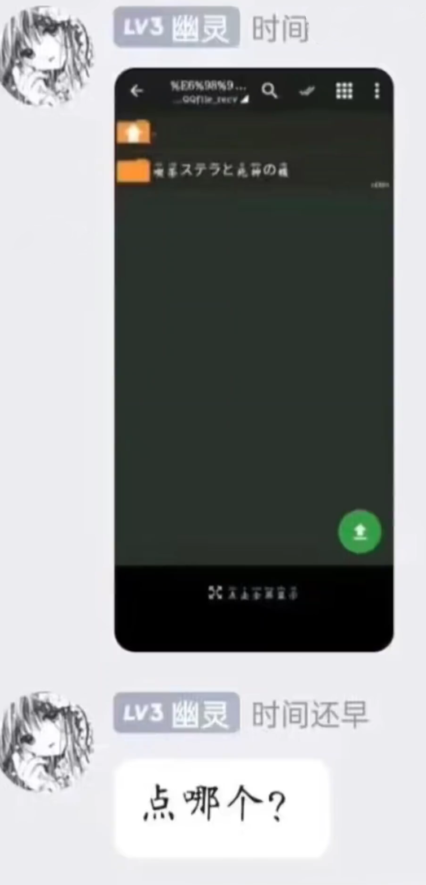

## 很抱歉没能让时间大人学会解压

这个梗原名为“很抱歉没有让宿傩大人使出全力”，出自《咒术回战》。

2024年4月6日，某Galgame群内有一位名为“时间还早”的新人请教群友怎样玩柚子社游戏《星光咖啡馆与死神之蝶》，并发了一张截图询问点哪个。

随后群内相继有多位大佬尝试教会他但无济于事，这个过程中所有与他对话过的人无一例外都红温破防了，最后都异口同声地说了句“抱歉没能让时间大人学会解压”。

群内其他人将这段聊天记录改编成了咒术回战的漫画版，在各个群内传播极为迅速，甚至有专门为看这个乐子的人申请加群。所幸最后有高手教会了他，杀死了比赛。

该梗常用于遇到纯小白无论怎么教都学不会的场景。

### 相关链接

+ [抱歉没能让时间大人学会解压](https://www.bilibili.com/video/BV1ZF4m1K7gg)