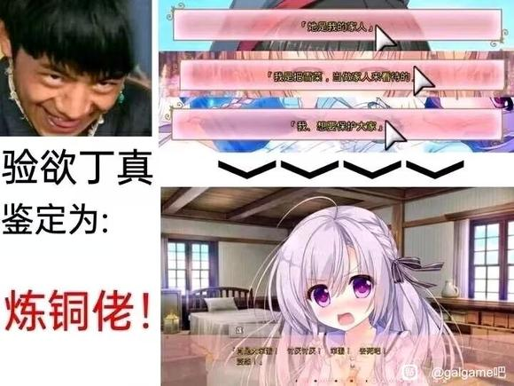

## 爱莲说

---

本指宋代周敦颐的作品《爱莲说》。在社群中有时用来表达对[永不枯萎的世界与终之花](https://vndb.org/v19658)中角色莲的喜爱~~以及自己是llk的事实~~ 

---

### 语源

  *以下可能涉及剧透*
  + 

      

      

        
         
        在《永不枯萎的世界与终之花》中，三次选择女主角是自己的家人将会进入莲路线。因为前文男主对莲的感情指向并不明显，再加上全选家人反成炼铜佬的奇妙进线逻辑带来的节目效果，使得<s>大家对莲越发喜爱了</s>这一说法广泛传播。
      
      
    

---